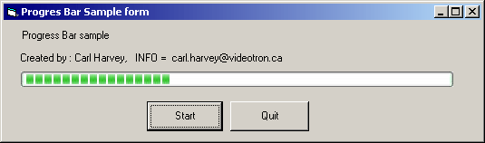



## Xp ProgressBar \*\*ORIGINAL\*\* With the SOURCE \!

### Description

Hi all, This is a custum progress bar like the XP one, i have noticed that someone already submit a XP progress bar but this poor submission does not provide the SOURCE !. So i have taken 30 min of my time and decide to give you this code which is verry simple 4 images, Bitblt,few lines of code and there you go. you can easely change the pictures to have another look :) Enjoy. I hate when people doesn't provide code...
 
### More Info
 

             |
---                |---
**Submitted On**   |2002-09-21 10:31:28
**By**             |[HarveySolutions](https://github.com/Planet-Source-Code/PSCIndex/blob/master/ByAuthor/harveysolutions.md)
**Level**          |Intermediate
**User Rating**    |4.7 (70 globes from 15 users)
**Compatibility**  |VB 5\.0, VB 6\.0
**Category**       |[Custom Controls/ Forms/  Menus](https://github.com/Planet-Source-Code/PSCIndex/blob/master/ByCategory/custom-controls-forms-menus__1-4.md)
**World**          |[Visual Basic](https://github.com/Planet-Source-Code/PSCIndex/blob/master/ByWorld/visual-basic.md)
**Archive File**   |[Xp\_Progres1341759212002\.zip](https://github.com/Planet-Source-Code/harveysolutions-xp-progressbar-original-with-the-source__1-39164/archive/master.zip)

